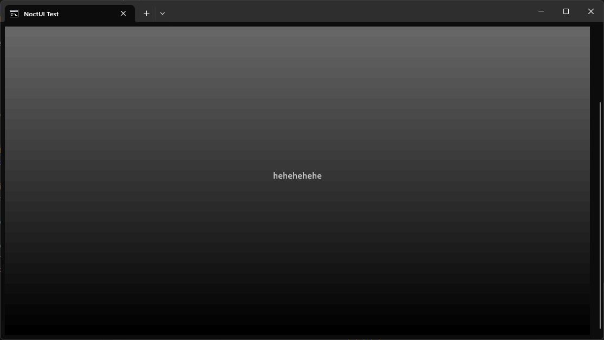

# NoctUI

NoctUI - React로 터미널 렌더링

<table>
    <tr>
        <td>
            
        </td>
    </tr>
    <tr>
        <td align="center">예시 화면</td>
    </tr>
</table>

위의 사진을 구현하려면 NoctUI로 아래와 같이 작성하면 됩니다.  

```tsx
import { useConsoleSize, View, Text } from "noctui";

export default function App() {
    const { width, height } = useConsoleSize();

    return <View
        style={{
            "backgroundGradient": {
                "start": "brightBlack",
                "rotation": 180,
                "end": "black"
            },
            "display": "flex",
            "alignItems": "center",
            "justifyContent": "center",
            width,
            height
        }}
    >
        <Text>hehehehehe</Text>
    </View>;
}
```

## 특징

NoctUI의 특징은 아래와 같습니다.  

* flex, position, zIndex 등 지원
* 터미널 마우스 입력 감지
* `useMouse`, `useInput` 훅으로 입력 감지
* 그 외 많은 기능들

## 사용법

NoctUI를 사용해보고 싶으신가요?  

아래 문서를 참고해주세요!  
[NoctUI의 기본 사용법](./BASICS.md)
